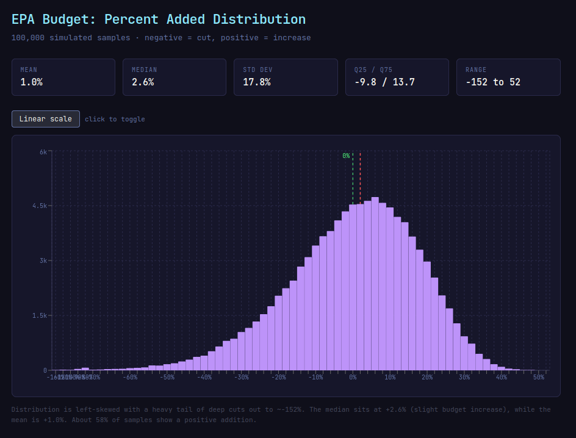

This repo records my data for resolving [the prediction market I created about water quality program funding cuts](https://manifold.markets/EricMoyer/epa-budget-for-water-quality-progra).

# Process

## Produce the initial JSON files

I excerpted files from the EPA appropriations text into `EPA-appropriations-text-FY2024-HR4366.txt`, `EPA-appropriations-text-FY2025-HR1968.html`, and `EPA-appropriations-text-FY2026-HR6938.html`. I had Claude create `EPA-budget-schema.md` based on `EPA-appropriations-text-FY2026-HR6938.html`
It then created the initial JSON files `epa_fy2025_hr1968_div_a_title_vii.json` and `epa_fy2026_hr6938_div_b_title_ii.json` based on the schema and the text files.
Next, I created the `prompts` directory and added `01-schema-update-prompt.md`,
asking Claude Code to update the schema to include fields for classifying water quality relevance and certainty, and to add those fields to the existing JSON files.
Then, I added `02-consistency-check.md` to do a quick check between the two
JSON files. It caught one place that would be good to rename for easier
comparison.

## Distribution of relevance
After the extracting the JSON and attaching the first ratings (that would be prompts 01 and 02 in the `prompts` directory), the distributions of the confidence ratings were:

```console
$ rg 'water_quality_relevance_certainty":' epa_fy2026_hr6938_div_b_title_ii.json |  sed -E 's/ *"(water_quality_relevance_certainty)": *
([0-9]+).*/\1: \2/' | sort | uniq -c

      7 water_quality_relevance_certainty: 2
     21 water_quality_relevance_certainty: 3
      6 water_quality_relevance_certainty: 4
     28 water_quality_relevance_certainty: 5

$ rg 'water_quality_relevance_certainty"' epa_fy2025_hr1968_div_a_title_vii.json |  sed -E 's/ *"(water_quality_relevance_certainty)": *
([0-9]+).*/\1: \2/' | sort | uniq -c

      2 water_quality_relevance_certainty: 1
      3 water_quality_relevance_certainty: 2
     16 water_quality_relevance_certainty: 3
      6 water_quality_relevance_certainty: 4
     20 water_quality_relevance_certainty: 5
```

## Joint distribution of relevance and certainty

Then I asked Claude to write a script to show the joint distribution of certainty and relevance. After a bit of tweaking, I got the following output:
```bash
python3 wq_joint_dist.py epa_fy2025_hr1968_div_a_title_vii.json
```
| Relevance                            | Certainty | Count |
|--------------------------------------|-----------|-------|
| for water quality programs           | 5         | 17    |
| partially for water quality programs | 3         | 13    |
| partially for water quality programs | 4         | 4     |
| not for water quality programs       | 5         | 3     |
| unknown                              | 1         | 2     |
| partially for water quality programs | 2         | 2     |
| not for water quality programs       | 3         | 2     |
| unknown                              | 2         | 1     |
| for water quality programs           | 3         | 1     |
| for water quality programs           | 4         | 1     |
| not for water quality programs       | 4         | 1     |


```bash
python3 wq_joint_dist.py epa_fy2026_hr6938_div_b_title_ii.json
```
| Relevance                            | Certainty | Count |
|--------------------------------------|-----------|-------|
| for water quality programs           | 5         | 24    |
| partially for water quality programs | 3         | 18    |
| partially for water quality programs | 2         | 4     |
| partially for water quality programs | 4         | 4     |
| not for water quality programs       | 5         | 4     |
| unknown                              | 2         | 3     |
| not for water quality programs       | 3         | 2     |
| for water quality programs           | 3         | 1     |
| for water quality programs           | 4         | 1     |
| not for water quality programs       | 4         | 1     |

(You need to use the version at 25888cc127f6d606136563236a7ddba3890a3445 to get
these results.)

## Redo for line-items only

After looking at the above and doing some spot-checks, I realized I only
cared about certainty and relevance for line items (i.e., leaf nodes in the
budget hierarchy). So I went back and added a filter to only include line items.

```bash
python3 wq_joint_dist.py epa_fy2025_hr1968_div_a_title_vii.json
```

| Relevance                            | Certainty | Count |
|--------------------------------------|-----------|-------|
| for water quality programs           | 5         | 16    |
| for water quality programs           | 4         | 1     |
| for water quality programs           | 3         | 1     |
| not for water quality programs       | 5         | 3     |
| not for water quality programs       | 4         | 1     |
| not for water quality programs       | 3         | 2     |
| partially for water quality programs | 4         | 2     |
| partially for water quality programs | 3         | 9     |
| partially for water quality programs | 2         | 2     |
| unknown                              | 2         | 1     |
| unknown                              | 1         | 2     |

```bash
python3 wq_joint_dist.py epa_fy2026_hr6938_div_b_title_ii.json
```

| Relevance                            | Certainty | Count |
|--------------------------------------|-----------|-------|
| for water quality programs           | 5         | 20    |
| for water quality programs           | 4         | 1     |
| for water quality programs           | 3         | 1     |
| not for water quality programs       | 5         | 4     |
| not for water quality programs       | 4         | 1     |
| not for water quality programs       | 3         | 2     |
| partially for water quality programs | 4         | 2     |
| partially for water quality programs | 3         | 13    |
| partially for water quality programs | 2         | 4     |
| unknown                              | 2         | 2     |

## Add earmarks data

After looking at the FY2026 data labeled "partially for water quality programs"
(which I generally agreed with), I started to look at the "unknown" items, which
were all earmarks.

I added the earmarks data from the FY2026 bill to the repository. But that
will be a lot of work to incorporate (and to find the FY2025 earmarks data).

I want to see how certain the conclusions are given the current data before
I try to get more certainty.

## Try the first Monte Carlo simulation
I added `03-simulate-epa-water-budget-allocations-to-assess-cuts.md` to ask Claude to write a Monte Carlo simulation based on the current data.

```bash
python3 simulate_epa_wq_cuts.py -n 100000
```

Yields:
```
Samples: 100000
Mean percent change: 0.96%
Std dev: 17.75%
97% credible interval: [-42.94%, 32.91%]
Percent of samples with >= 10% cut: 32.9%
Results written to epa_cut_samples.csv
```

This looks like . (This was a plot generated
by Claude based on the `epa_cut_samples.csv` output from the above simulation.)

Unfortunately, 33% of the samples show a cut of 10% or more. And the mean is
a 1% cut. So, I need to do more work to reduce the uncertainty. The first thing
to try is to fix the simplistic "flip" for incorrect relevance classifications.
Since it will no longer be switching 0% to 100% or vice versa, that should
reduce the variance.

## Add a more realistic model for incorrect classifications

I added `04-dont-use-flip-incorrectness.md` but pasted it into a planning
session in the same conversation that implemented the simulation to take
advantage of the context.

The result:
```bash
python3 simulate_epa_wq_cuts.py -n 100000
```

```
Samples: 100000
Mean percent change: -0.15%
Std dev: 23.62%
97% credible interval: [-60.28%, 40.23%]
Percent of samples with >= 10% cut: 37.2%
Results written to epa_cut_samples.csv
```

This has more variation and a higher percentage of samples with >= 10% cuts.

The next improvement is to fix the low probability of "unknown" being correct.
It's pretty clear that they are unknown. I'll increase the certainty and mark
my manual change in the data. I don't expect this to change much, but it is
an inexpensive step and improves the accuracy of the model.

## Make the "unknown" items more certain

I marked all the "unknown" items as certainty 5.

After running the simulation again, I got:

```
Samples: 100000
Mean percent change: -0.06%
Std dev: 23.61%
97% credible interval: [-59.75%, 40.24%]
Percent of samples with >= 10% cut: 37.3%
Results written to epa_cut_samples.csv
```

So, now an even higher percentage of samples show >= 10% cuts, but the CI is
smaller.